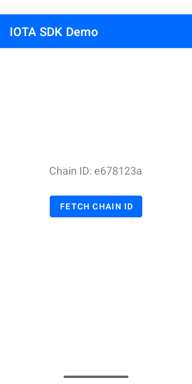

# IOTA SDK Android Demo

A minimal Android app demonstrating the IOTA Kotlin SDK. It fetches the chain ID from the IOTA devnet using `GraphQlClient`.

## Prerequisites

- Android Studio (or Android SDK command-line tools)
- Android SDK with API level 35
- JDK 17+
- Set `ANDROID_HOME` environment variable or create a `local.properties` file in the `android-demo/` directory:
  ```
  sdk.dir=/path/to/your/Android/Sdk
  ```

## Build & Run

### Using the published SDK (default)

The app is configured to use the latest published `org.iota:iota-sdk` from Maven Central:

```bash
cd bindings/kotlin/examples/android-demo
./gradlew :app:assembleDebug
```

The APK will be at `app/build/outputs/apk/debug/app-debug.apk`.

### Using locally built native libraries

If you want to test with locally built `.so` files:

1. Add Rust Android targets and install cargo-ndk:
   ```bash
   rustup target add aarch64-linux-android armv7-linux-androideabi x86_64-linux-android i686-linux-android
   cargo install cargo-ndk
   ```

2. Build the native libraries from the repository root:
   ```bash
   make kotlin-android
   ```

3. Copy the libraries into the app's `jniLibs`:
   ```bash
   mkdir -p app/src/main/jniLibs/arm64-v8a
   mkdir -p app/src/main/jniLibs/armeabi-v7a
   mkdir -p app/src/main/jniLibs/x86_64
   mkdir -p app/src/main/jniLibs/x86
   cp ../../lib/android-aarch64/libiota_sdk_ffi.so app/src/main/jniLibs/arm64-v8a/
   cp ../../lib/android-arm/libiota_sdk_ffi.so app/src/main/jniLibs/armeabi-v7a/
   cp ../../lib/android-x86-64/libiota_sdk_ffi.so app/src/main/jniLibs/x86_64/
   cp ../../lib/android-x86/libiota_sdk_ffi.so app/src/main/jniLibs/x86/
   ```

4. Update `app/build.gradle.kts` dependencies to use the local build instead of Maven Central:
   ```kotlin
   dependencies {
       // Local JAR from bindings/kotlin (replaces the Maven Central dependency)
       implementation(files("../../../build/libs/iota-sdk-0.0.1-alpha.4.jar"))
       // Transitive dependencies (not resolved automatically from a file dependency)
       implementation("org.jetbrains.kotlinx:kotlinx-coroutines-core:1.7.3")
       implementation("org.jetbrains.kotlinx:kotlinx-serialization-json:1.6.3")
       implementation("net.java.dev.jna:jna:5.13.0@aar")
       implementation("org.jetbrains.kotlinx:kotlinx-coroutines-android:1.9.0")
       implementation("androidx.appcompat:appcompat:1.7.0")
       implementation("com.google.android.material:material:1.12.0")
       implementation("androidx.activity:activity-ktx:1.9.3")
       implementation("androidx.lifecycle:lifecycle-runtime-ktx:2.8.7")
   }
   ```

5. Build and install:
   ```bash
   ./gradlew :app:installDebug
   ```

## What It Does

The app displays a button that, when pressed, calls `GraphQlClient.newDevnet().chainId()` and shows the result (or error) on screen.

### Expected Result

<p align="center">
  
</p>
