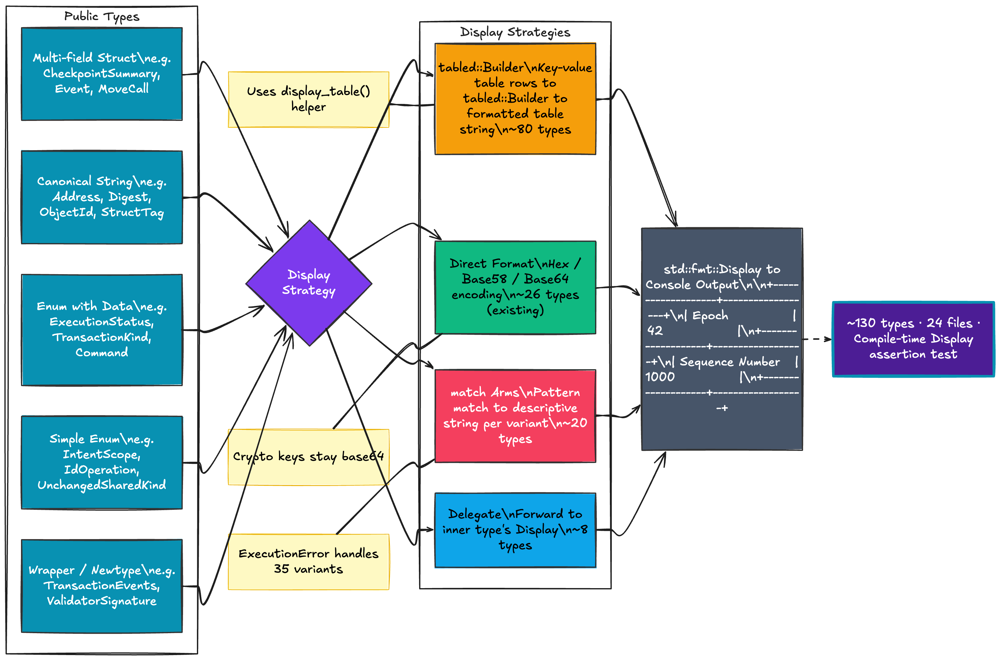

# iota-sdk-types

[](https://crates.io/crates/iota-sdk-types)
[](https://docs.rs/iota-sdk-types)

The `iota-sdk-types` crate provides the definitions of the core types that are
part of the public API of the IOTA blockchain.

## Display Support

All public types implement `std::fmt::Display` for readable console output. Multi-field structs render as structured key-value tables using [`tabled`](https://crates.io/crates/tabled).

### Example

```rust
use iota_sdk_types::GasCostSummary;

let gas = GasCostSummary {
    computation_cost: 1000,
    computation_cost_burned: 500,
    storage_cost: 200,
    storage_rebate: 50,
    non_refundable_storage_fee: 10,
};
println!("{gas}");
```

```
+----------------------------+------+
| Computation Cost           | 1000 |
+----------------------------+------+
| Computation Cost Burned    | 500  |
+----------------------------+------+
| Storage Cost               | 200  |
+----------------------------+------+
| Storage Rebate             | 50   |
+----------------------------+------+
| Non-Refundable Storage Fee | 10   |
+----------------------------+------+
```

### Display Strategy



| Type Category            | Approach                          | Examples                                             |
| ------------------------ | --------------------------------- | ---------------------------------------------------- |
| Multi-field structs      | `tabled::Builder` key-value table | `CheckpointSummary`, `TransactionEffectsV1`, `Event` |
| Canonical string types   | Hex / base58 / base64             | `Address`, `Digest`, `ObjectId`, `StructTag`         |
| Enums with data          | `match` with descriptive output   | `ExecutionStatus`, `TransactionKind`, `Command`      |
| Simple enums             | Short label                       | `IntentScope`, `IdOperation`                         |
| Wrappers / newtypes      | Delegate to inner value           | `TransactionEvents`, `ValidatorSignature`            |
| Crypto keys & signatures | Base64 encoding                   | `Ed25519PublicKey`, `Secp256k1Signature`             |

### Coverage

~130 types across all modules:

- **Core**: `Address`, `Digest`, `ObjectId`, `Identifier`, `StructTag`, `TypeTag`
- **Object**: `Object`, `ObjectReference`, `ObjectData`, `MoveStruct`, `MovePackage`, `Owner`, `ObjectType`
- **Checkpoint**: `CheckpointSummary`, `SignedCheckpointSummary`, `CheckpointContents`, `EndOfEpochData`
- **Effects**: `TransactionEffects`, `TransactionEffectsV1`, `ChangedObject`, `ObjectIn`, `ObjectOut`
- **Execution**: `ExecutionStatus`, `ExecutionError` (35 variants), `MoveLocation`
- **Events**: `TransactionEvents`, `Event`, `BalanceChange`
- **Transaction**: `Transaction`, `TransactionKind`, `ProgrammableTransaction`, `Command`, `MoveCall`, `Input`, `Argument`, and 30+ more
- **Crypto**: `SimpleSignature`, `UserSignature`, `MultisigCommittee`, `ZkLoginAuthenticator`, `PasskeyAuthenticator`, `Intent`, and more
- **Validator**: `ValidatorCommittee`, `ValidatorAggregatedSignature`
- **IOTA Names**: `NameRecord`, `Registry`, `IotaNamesConfig`, `NameRegistration`
- **Other**: `GasCostSummary`, `Coin`, `MovePackageData`

### Compile-Time Verification

A test module in `src/lib.rs` asserts at compile time that every listed type implements `Display`:

```bash
cargo test -p iota-sdk-types --all-features
```

## Feature Flags

- `serde` — Serializing and deserializing types to/from BCS
- `schemars` — JSON schema generation
- `rand` — Random instance generation
- `hash` — Hashing and address derivation
- `proptest` — Property-based testing support
