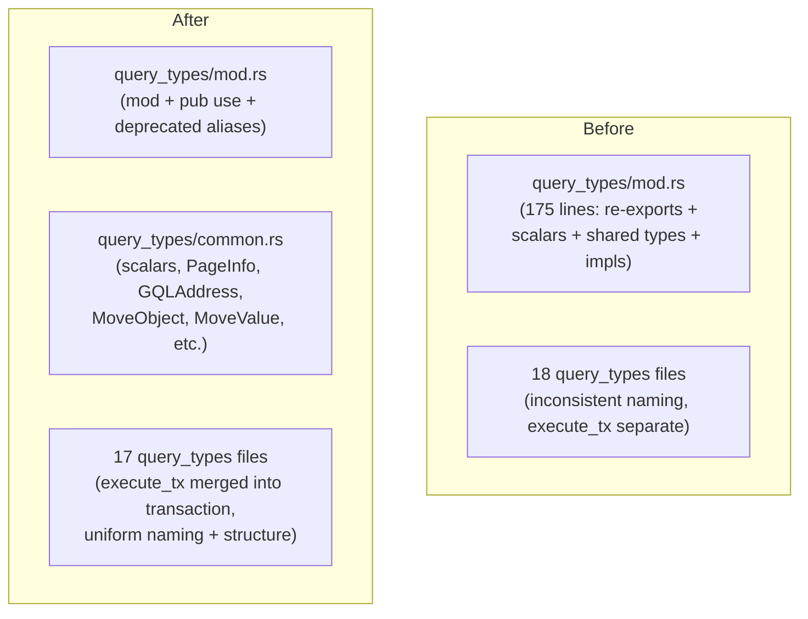

# System Design: GraphQL Client Restructure

## Architecture Overview

The refactor targets the `query_types/` module tree. No changes to business logic, `api/`, or `client.rs`.



## Key Design Changes

### 1. Extract `query_types/common.rs`

Move the following from `query_types/mod.rs` into `query_types/common.rs`:

| Item | Type | Lines in mod.rs |
|------|------|----------------|
| `impl_scalar!(Address, schema::IotaAddress)` | Scalar mapping | 93 |
| `impl_scalar!(ObjectId, schema::IotaAddress)` | Scalar mapping | 94 |
| `impl_scalar!(u64, schema::UInt53)` | Scalar mapping | 95 |
| `impl_scalar!(JsonValue, schema::JSON)` | Scalar mapping | 96 |
| `Base64` struct | Scalar | 98-100 |
| `BigInt` struct | Scalar | 102-104 |
| `DateTime` struct | Scalar | 106-108 |
| `MoveData` struct | Scalar | 110-112 |
| `GQLAddress` struct | Shared fragment | 118-122 |
| `MoveObject` struct | Shared fragment | 124-128 |
| `MoveObjectContents` struct | Shared fragment | 130-134 |
| `MoveValue` struct | Shared fragment | 136-142 |
| `MoveType` struct | Shared fragment | 144-148 |
| `PageInfo` struct | Pagination | 154-166 |
| `TryFrom<BigInt> for u64` | Impl | 168-174 |

### 2. Standardize QueryVariables Naming

Adopt the convention: query Args type name = query struct name with `Query` replaced by `Args`.

| File | Current Name | New Name |
|------|-------------|----------|
| `balance.rs` | `BalanceArgs` | `BalanceQueryArgs` |
| `checkpoint.rs` | `CheckpointArgs` | `CheckpointQueryArgs` |
| `epoch.rs` | `EpochArgs` | `EpochQueryArgs` |
| `dry_run.rs` | `DryRunArgs` | `DryRunQueryArgs` |
| `execute_tx.rs` | `ExecuteTransactionArgs` | `ExecuteTransactionQueryArgs` |
| `active_validators.rs` | `ActiveValidatorsArgs` | `ActiveValidatorsQueryArgs` |
| `dynamic_fields.rs` | `DynamicFieldArgs` | `DynamicFieldQueryArgs` |
| `dynamic_fields.rs` | `DynamicFieldConnectionArgs` | `DynamicFieldsQueryArgs` |
| `iota_names.rs` | `ResolveIotaNamesAddressArgs` | `ResolveIotaNamesAddressQueryArgs` |
| `iota_names.rs` | `IotaNamesRegistrationsArgs` | `IotaNamesRegistrationsQueryArgs` |
| `iota_names.rs` | `IotaNamesDefaultNameArgs` | `IotaNamesDefaultNameQueryArgs` |
| `move_view_call.rs` | `MoveViewCallArgs` | `MoveViewCallQueryArgs` |
| `protocol_config.rs` | `ProtocolVersionArgs` | `ProtocolConfigQueryArgs` |
| `packages.rs` | `PackageArgs` | `PackageQueryArgs` |
| `packages.rs` | `PackagesQueryArgs` | *(already correct)* |
| `packages.rs` | `PackageVersionsArgs` | `PackageVersionsQueryArgs` |
| `checkpoint.rs` | `CheckpointsArgs` | `CheckpointsQueryArgs` |
| `transaction.rs` | `TransactionBlockArgs` | `TransactionBlockQueryArgs` |
| `transaction.rs` | `TransactionBlocksQueryArgs` | *(already correct)* |

> **Note:** Names already following the convention (e.g., `ObjectQueryArgs`, `ObjectsQueryArgs`, `EventsQueryArgs`, `TransactionBlocksQueryArgs`, `PackagesQueryArgs`) remain unchanged.

### 3. Standardize File Structure

Every query_types file should follow this layout:

```rust
// Copyright header

use crate::query_types::{...};

// ===========================================================================
// Queries
// ===========================================================================

// Query struct definitions...

// ===========================================================================
// Query Args
// ===========================================================================

// QueryVariables definitions...

// ===========================================================================
// Types
// ===========================================================================

// Fragment/type definitions...

// ===========================================================================
// Conversions
// ===========================================================================
// (optional section, only if the file has TryFrom/Into impls)
```

### 4. Rename Misleading Types

- `MovePackageQuery` (fragment, not query) → `MovePackage` in `packages.rs`
- `TransactionsFilter` (semantically wrong: singular filter struct, not a collection) → `TransactionBlockFilter` in `transaction.rs`, matching the underlying `graphql_type = "TransactionBlockFilter"`

### 5. Merge `execute_tx.rs` into `transaction.rs`

`execute_tx.rs` contains only transaction-block types (`ExecuteTransactionQuery`, `ExecuteTransactionQueryArgs`, `ExecutionResult`, `TransactionBlockEffects`) — all of which are semantically part of the transaction domain. The file will be folded into `transaction.rs` under a dedicated section header:

```rust
// ===========================================================================
// Execute Transaction
// ===========================================================================
```

The `mod execute_tx;` declaration and its `pub use execute_tx::{ ... }` re-export block in `mod.rs` are removed. All public names are re-exported directly from `transaction.rs` via the existing `pub use transaction::{ ... }` block.

### 6. Backward Compatibility (Breaking Change)

Because this refactor establishes a completely new semantic structure, it is considered a **breaking change** and will trigger a major version bump. 
We will **not** provide `#[deprecated]` aliases in `query_types/mod.rs`. This enforces immediate migration to the correct type names across downstream codebases and prevents long-term bloat.

## Design Decisions

1. **`common.rs` over further splitting**: A single `common.rs` is preferred over separate `scalars.rs` + `shared_types.rs` because the total content is ~80 lines and there's high cohesion.
2. **Preserving re-exports**: Since this is a public crate (published on crates.io), we add deprecated type aliases rather than removing old names outright.
3. **Not touching `api/` modules**: The API layer references query_types internally. While it also has structure issues, mixing two refactors increases risk. Defer to a follow-up.
4. **Merging `execute_tx.rs`**: The file has no standalone rationale — its types belong to the transaction domain and the merge reduces navigational surface area without any trade-off.
5. **`TransactionsFilter` rename**: The Rust name was inconsistent with the GraphQL schema name (`TransactionBlockFilter`) and semantically misleading (plural form for a singular struct). The rename aligns Rust and GraphQL naming.
